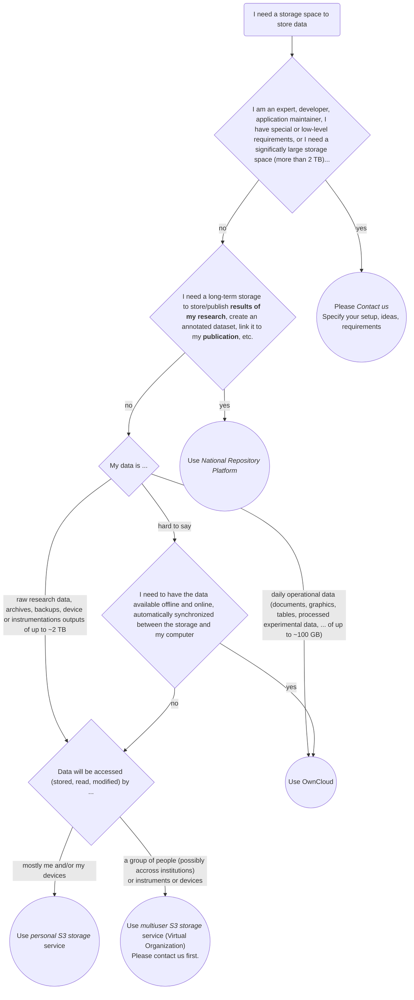

---

Use this page to quickly **choose a service** from a set of **basic** services we offer and **set it up** so that it works for you on a couple of minutes. This fast process requires an **average experienced** computer user.

# Choose a service



# Install and Configure

## OwnCloud

### Quick setup

* To register and/or log in click on `Log in` button [here](https://owncloud.cesnet.cz/) and follow the instructions. Once logged-in, use drag-and-drop to upload files, click to download.

If it does not work: [read full documentation](https://du.cesnet.cz/en/navody/owncloud/start), [contact support](https://docs.du.cesnet.cz/en/docs/introduction/support).

> #### Where to go from here
>
> * To **sync** the cloud data storage space to your local drive, download and install [OwnCloud client](https://owncloud.com/desktop-app), run it and configure it using https://ownloud.cesnet.cz as the server address.
> * To **share** a folder with a colleague, click on the share symbol and enter your colleaugue's e-mail address (you need to enter whole address as there is [intentionally] no autocomplete).

## Personal S3

### Windows Quick setup

* Register in [Perun](https://einfra.cesnet.cz/), wait for 30 minutes to allow database synchrozation.
* Register in [Gatekeeper](https://access.du.cesnet.cz/) and generate a pair of keys, record the endpoint address and both keys.
* Install [S3 Browser](https://s3browser.com/).
* Add a new account to S3 Browser (*Accounts* / *Add new account..*); select `S3 Compatible Storage` as *Account type* and enter the credentials recorded before: `endpoint address` as *API endpoint*, `access-key` as *Access Key ID*, and `secret-key` as *Secret Access Key*.
* Use **S3 Browser** to copy files there and back.

If it does not work: [read full documentation](../object-storage-s3/s3-service), [contact support](https://docs.du.cesnet.cz/en/docs/introduction/support).

> #### Where to go from here:
>
> - understand more about the [S3 service](../object-storage-s3/s3-service)
> - check [different ways](../object-storage-s3/s3-clients) to access your storage
> - get [more information](https://s3browser.com/help.aspx) about using **S3 Browser**
> - setup and use [versioning support](https://s3browser.com/amazon-s3-versioning.aspx) in **S3 Browser**
> - install and configure [rclone](object-storage-s3/rclone) command line tool to
>      - [synchronize files](../object-storage-s3/rclone#rclone-basic-controls) between the local drive and the storage
>      - create automation scripts
>      - configure and use [encrypted storage](../object-storage-s3/rclone#configuration-and-management-of-encrypted-buckets)
>      - [mount](../object-storage-s3/rclone#mounting-the-remote-as-a-filesystem-or-a-drive) S3 storage as disk
> - ask for [help or support](../introduction/support)

### MAC quick setup

* Register in [Perun](https://einfra.cesnet.cz/), wait for 30 minutes to allow database synchrozation.
* Register in [Gatekeeper](https://access.du.cesnet.cz/) and generate a pair of keys, record the endpoint address and both keys.
* Install [Cyber Duck](https://cyberduck.io/). 
* Open connection (*File* / *Open Connection*); select `Amazon S3` and enter the credentials recorded before: `endpoint address` as *Server*, `access-key` as *Access Key ID*, and `secret-key` as *Secret Access Key*.
* Select *Bookmark* / *New Bookmark* to store the configuration for the future use
* Use **Cyber Duck** to copy files there and back.

If it does not work: [read full documentation](../object-storage-s3/s3-service), [contact support](https://docs.du.cesnet.cz/en/docs/introduction/support).

> #### Where to go from here:
>
> - understand more about the [S3 service](../object-storage-s3/s3-service)
> - check [different ways](../object-storage-s3/s3-clients) to access your storage
> - get [more information](https://docs.cyberduck.io/) or [ask community for help](https://github.com/iterate-ch/cyberduck/discussions) about using **Cyber Duck**
> - install and configure [rclone](object-storage-s3/rclone) command line tool to
>      - [synchronize files](../object-storage-s3/rclone#rclone-basic-controls) between the local drive and the storage
>      - create automation scripts
>      - configure and use [encrypted storage](../object-storage-s3/rclone#configuration-and-management-of-encrypted-buckets)
>      - [mount](../object-storage-s3/rclone#mounting-the-remote-as-a-filesystem-or-a-drive) S3 storage as disk
> - ask for [help or support](../introduction/support)

### Linux quick setup

* Register in [Perun](https://einfra.cesnet.cz/), wait for 30 minutes to allow database synchrozation.
* Register in [Gatekeeper](https://access.du.cesnet.cz/) and generate a pair of keys, record the endpoint address and both keys.
* [Download](https://rclone.org/downloads/) and install **rclone**.
* [Configure](../object-storage-s3/rclone) **rclone** by calling ```rclone config```; use credentials recorded before.
* Use ```rclone sync``` to synchronize files to or from the storage (see [here](../object-storage-s3/rclone) or run ```rclone help``` or ```man rclone``` for more info).

If it does not work: [read full documentation](../object-storage-s3/s3-service), [contact support](https://docs.du.cesnet.cz/en/docs/introduction/support).

> #### Where to go from here:
>
> - understand more about the [S3 service](../object-storage-s3/s3-service)
> - check [different ways](../object-storage-s3/s3-clients) to access your storage
> - get [more information]https://rclone.org/) about using **rclone**
> - use [rclone](object-storage-s3/rclone) to
>      - [synchronize files](../object-storage-s3/rclone#rclone-basic-controls) between the local drive and the storage
>      - create automation scripts
>      - configure and use [encrypted storage](../object-storage-s3/rclone#configuration-and-management-of-encrypted-buckets)
>      - [mount](../object-storage-s3/rclone#mounting-the-remote-as-a-filesystem-or-a-drive) S3 storage as disk
> - ask for [help or support](../introduction/support)


