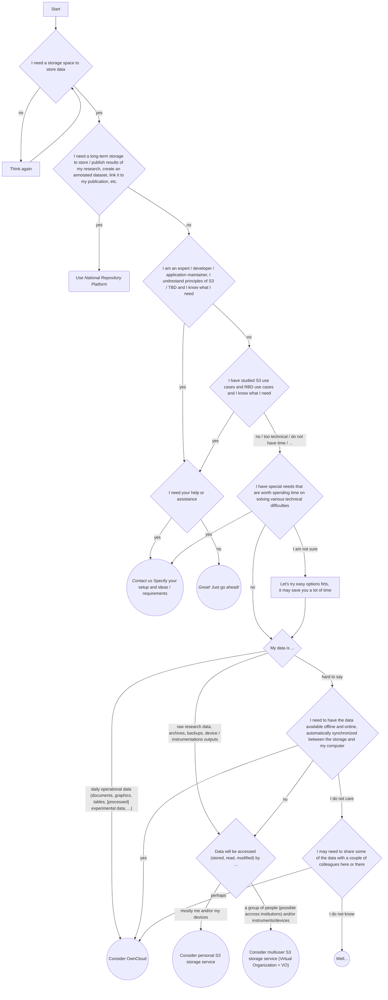

```mermaid
graph TD
    A[Start] --> B{I need a storage space to store data}
    B -->|no| C[Think again]
    C --> B
    B -->|yes| D{I need a long-term storage to store / publish results of my research, create an annotated dataset, link it to my publication, etc.}
    D -->|yes| E(Use <i>National Repository Platform</i>)
    D -->|no| F{I am an expert / developer / application maintainer, I undrestand principles of S3 / TBD and I know what I need}
    F -->|yes| G{I need your help or assistance}
    G -->|yes| J(("`*Contact us* Specify your setup and ideas / requirements`"))
    click G href "../introduction/support" "Support Page"
    G -->|no| K(("`*Great!* Just go ahead!`"))
    F -->|no| H{I have studied S3 use cases and RBD use cases and I know what I need}
    H -->|yes| G
    H -->|no / too technical / do not have time / ...| I{I have special needs that are worth spending time on solving various technical difficulties}
    I -->|yes| J
    I -->|no| M{My data is ...}
    I -->|I am not sure| L[Let's try easy options firts, it may save you a lot of time]
    L --> M
    M -->|"daily operational data (documents, graphics, tables, [processed] experimental data, ...)"| Q((Consider OwnCloud))
    M -->|raw research data, archives, backups, device / instrumentations outputs| P{"Data will be accessed (stored, read, modified) by ..."}
    M -->|hard to say| N{I need to have the data available offline and online, automatically synchronized between the storage and my computer}
    N -->|I do not care| O{I may need to share some of the data with a couple of colleagues here or there}
    N -->|yes| Q
    N -->|no| P
    O -->|perhaps| Q
    O -->|I do not know| R((Well...))
    P -->|mostly me and/or my devices| S((Consider personal S3 storage service))
    P -->|"a group of people (possible accross institutions) and/or instruments/devices"| T(("Consider multiuser S3 storage service (Virtual Organization = VO)"))
```
