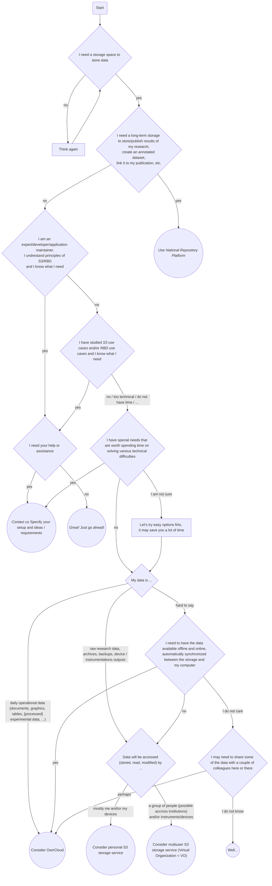

This chapter aims to the impatient: almost no details, no philosophy, no theory - just go through the following steps and there is a good chance you land having something useful up and running fast. Start with the flowchart and let it guide you.

