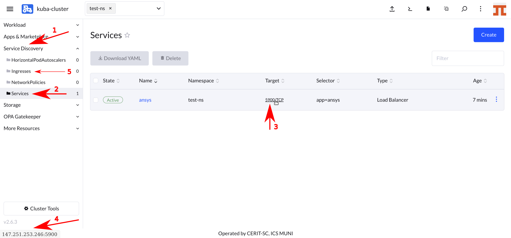

## Running Ansys

If not already logged in, log in to [rancher.cloud.e-infra.cz](https://rancher.cloud.e-infra.cz), see [Rancher](https://cerit-sc.githu
b.io/kube-docs/docs/rancher.html) section.

You can run the Ansys application by following the steps below. This application has a persistent home directory, which means that if you delete the application and later reinstall the application under the same name, the contents of the home directory will be preserved. It is also possible to connect some storage from e-INFRA CZ.

### Notes

* Default project had quota limit for 12 guaranteed CPUs and quota limit for 16 CPUs. Do not select more than 10 guaranteed CPUs and more than 14 CPUs limit. If you need more, just [ask](mailto:k8s@ics.muni.cz). This may be increased in the future so you can ask for more CPUs.

* If you do not select `Customize Helm options before installing' in the **Install the Application** step, the installation appears to fail, but actually works after some time.

### Select Application to Run

Make sure you have not selected a namespace and see `User namespaces only` (1) at the top of the Rancher page.

Navigate through `App & Marketplace` (2), `Charts` (3), restrict charts to `cerit-sc` (4) only and select `Ansys` (5). See screenshot below.

### Selecting the version of the application

When you click on the chart, you can select the application version as shown below. Select 'Chart Version', under 'Application Version' you will find the exact Ansys version. Versions may differ in time. Press `Install` to continue.

### Installing the application

Now you are ready to install the Ansys application. In most cases you will leave both `Namespace` (1) and `Name` (2) intact, but select `Customize Helm options before install` (3), but you can select any namespace except `default`. The `default` namespace is available, but is not intended to be used. The `Name` is used in the URL to access the application. The `Name` must be unique in the `Namespace`, i.e. you cannot run two or more instances with the same `Name` in the same `Namespace`. If you delete the application and later reinstall it using the same `Name`, the contents of the home directory will be preserved.

In the first part of the form, select the method of access display. The [VNC]((https://cs.wikipedia.org/wiki/Virtual_Network_Computing) method is the default. You will need a vncview program [realvnc](https://www.realvnc.com/en/connect/download/viewer/) or `vncviewer` on most Linux distributions. On MacOS, just type `vnc://host` in the Safari browser, replacing `host` according to the instructions below. Do not press `Install` until the form is complete. When using *VNC*, only software drawing is available, no 3D acceleration is possible.

If VNC is not selected, the *WEBRTC* method will be used. This option is still in beta and not ready for production use, but full 3D OpenGL acceleration is available.

In the second part of the form you choose a password. This password is used for VNC login. If VNC is not selected, you must also fill in `username`, these credentials will be used in the browser to connect to the *WEBRTC* session.

In the third part of the form, you select whether you want persistent home, i.e. home that will be preserved even if you uninstall the application. Note: persistent home is bound to application name from the very beginning of the install form. That is, if you set name to `ansys`, persistent home will be bound to name `ansys`. If you choose name `ansys-0` next time, you will get new home bound with name `ansys-0`.

In this part you can select **e-INFRA CZ** storage to connect to the application. If you check `External Storage`, some more options will appear. You can select storage and credentials. Currently only `storage-brno12-cerit.metacentrum.cz` is supported. Username is e-infra ([metacentrum](https://metavo.metacentrum.cz/)) login and password **is not** Metacentrum password, but different set by administrator, [ask](mailto:k8s@ics.muni.cz) if you need to set. We prepare more convenient way. This storage will be mounted to `/storage` directory.

In the fourth part of the form you can select the requested resources. This step is optional. Minimum' CPU or RAM is a guaranteed amount of CPU and RAM, the system reserves these resources for the application. However, the application can exceed the guaranteed resources up to `Maximum`. In this case, the resources are not exclusive and can be shared with other applications. If the application exceeds `Maximum` CPU, it will be limited, if it exceeds `Maximum` RAM, it will be terminated (you will see an OOMKill report) and restarted. See note above about maximum values.

In the fifth part of the form, select a timeout of 1200 seconds, this is due to very large Ansys images. Finally press `Install`.

### Wait for the application to start

When you hit `Install`, you will see the installation log. When you see `SUCCESS` (see screenshot below), the application is running.

#### Notes

* It may take some time before the application is ready, as it downloads a 20GB docker container, if it is not already cached, the first start can take up to 20 minutes.
* If entered password was not correct, it will be pending indefinitely. In this case, delete the application and start again.

### Connecting to the Running Instance

Once the application is running, for the *VNC* version, navigate through `Service Discovery` (1) and `Services` (2), hover the mouse over `Target` (3) and depending on the browser you are using, you should see the target URL (4). Chrome browser shows it in the lower left corner. This is the IP and port you need to pass to your `vncviewer` application or fill in the Safari navigation bar, e.g. `vnc://147.251.253.246`.

In case of *WEBRTC*, instead of `Services`, navigate to `Ingresses` (5) and you will see the full URL to click to start the *WEBRTC* connection.

The *VNC* client will ask for the password. Enter the password from the form. *WEBRTC* connection will ask for username and password, these **are not** metacentrum username and password, but the ones from the beginning of the form.

## Ansys

At the first login the desktop will look like this:

You will see the `license checker` which is made to check the available Ansys licenses. You can choose which licenses you want to use. If there are no free licenses, it will check periodically and if the license is free, it will start fluently. Alternatively, you can start other parts of Ansys using icons on the desktop or using terminal.

Since Ansys is a licensed product, you must agree that you are using this product for academic purposes only and that you are entitled to use the license, i.e. you are a MetaCentrum user.

## Delete Running Instance

If you decide you no longer need an application, you can delete it. Just go to `Apps & Marketplace` (1), `Installed Applications` (2), select the application (3) and press `Delete` (4). The data in the home directory will not be deleted if you select persistent home. Running the application again with the same name will restore access to the home folder.

