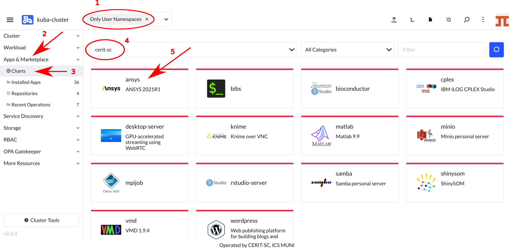
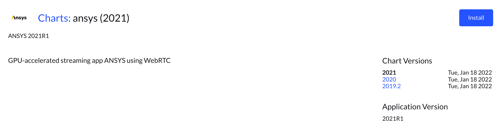
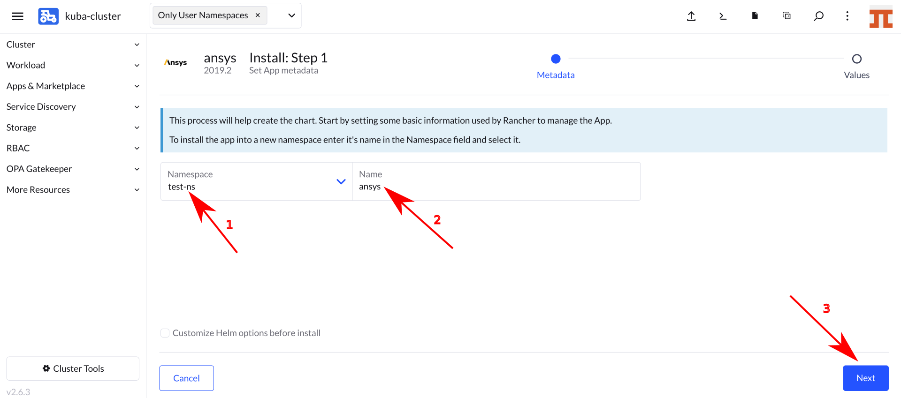

## Running Ansys

If not already logged, log to [rancher.cloud.e-infra.cz](https://rancher.cloud.e-infra.cz), see [Rancher](https://cerit-sc.githu
b.io/kube-docs/docs/rancher.html) section.

Following the steps below, you can run Ansys application. This application has persistent home directory, it means, that if you delete the application and later install the application again preserving its name, content of home directory will be preserved. It also possible to connect some storage from e-infra.

### Select Application to Run

Ensure, you did not select any namespace and see `Only User Namespaces` at the top of the Rancher page.

Navigate through `App & Marketplace` (1), `Charts` (2) and select `Ansys` (3). See screenshot below.

### Select Version of the Application

When you click on the chart, you can select version of application as shown below. Select `Chart Version`, you find exact Ansys version under `Application Version`. Versions can vary in time. Hit `Install` to continue.

### Install the Application

Now you can install the Ansys application. In most cases, keep both `Namespace` (1) and `Name` (2) intact, however, you can select namespace as desired except `default`. The `default` namespace is available but it is not meant to be used. The `Name` will be in URL to access the application. The `Name` must be unique in the `Namespace`, i.e., you cannot run two or more instances with the same `Name` in the same `Namespace`. If you delete the application and later install the application again preserving its `Name`, content of home directory will be preserved.

