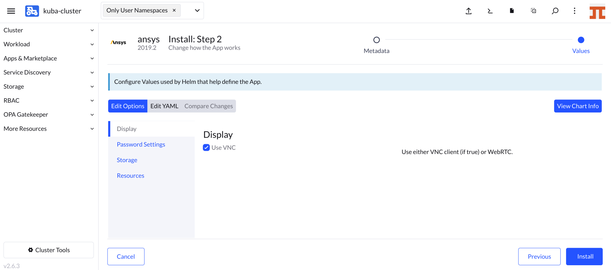
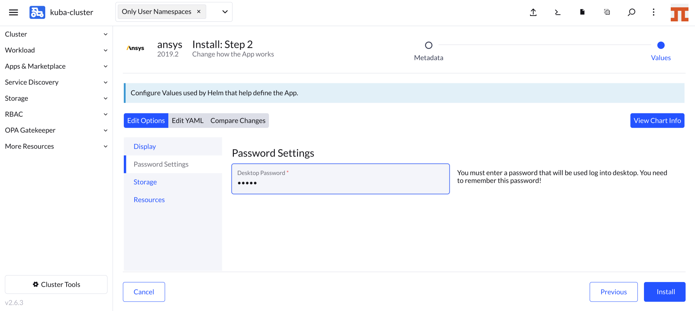
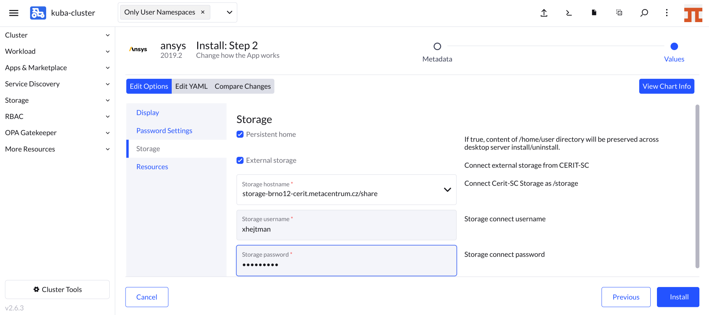
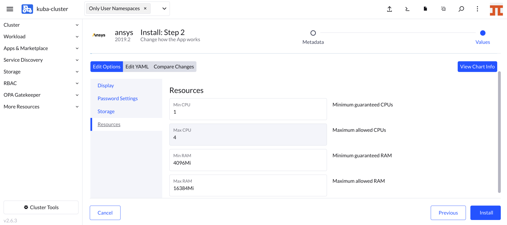

## Running Ansys

If not already logged, log to [rancher.cloud.e-infra.cz](https://rancher.cloud.e-infra.cz), see [Rancher](https://cerit-sc.githu
b.io/kube-docs/docs/rancher.html) section.

Following the steps below, you can run Ansys application. This application has persistent home directory, it means, that if you delete the application and later install the application again preserving its name, content of home directory will be preserved. It also possible to connect some storage from e-infra.

### Select Application to Run

Ensure, you did not select any namespace and see `Only User Namespaces` (1) at the top of the Rancher page.

Navigate through `App & Marketplace` (2), `Charts` (3), limit charts only to `cerit-sc` (4) and select `Ansys` (5). See screenshot below.

### Select Version of the Application

When you click on the chart, you can select version of application as shown below. Select `Chart Version`, you find exact Ansys version under `Application Version`. Versions can vary in time. Hit `Install` to continue.

### Install the Application

Now you can install the Ansys application. In most cases, keep both `Namespace` (1) and `Name` (2) intact, however, you can select namespace as desired except `default`. The `default` namespace is available but it is not meant to be used. The `Name` will be in URL to access the application. The `Name` must be unique in the `Namespace`, i.e., you cannot run two or more instances with the same `Name` in the same `Namespace`. If you delete the application and later install the application again preserving its `Name`, content of home directory will be preserved.

In the first part of the form, you select access display method. [VNC]((https://cs.wikipedia.org/wiki/Virtual_Network_Computing) method is default. You will need some vncview program [realvnc](https://www.realvnc.com/en/connect/download/viewer/) or `vncviewer` on most Linux distribution. On MacOS, just type `vnc://host` into the Safari browser, replace `host` according to instructions below. Do not hit `Install` until the form is completed. Using *VNC*, only software drawing is available, no 3D acceleration is possible.

If VNC is not selected, *WEBRTC* method is used. This option is still in beta version and not ready for production use, however, full 3D OpenGL acceleration is available.

In the second part of the form, you select `password`. This password is used to login through VNC. If VNC is not selected, you need to fill also `username`, these credentials will be used in the browser to attach to the *WEBRTC* session.

In the third part of the form, you select if you desire persitent home, i.e., home that will be preserved even if you uninstall the application. Note: persistent home is bound with application name from the very beginning of install form. It means, if you set name to `ansys`, persistent home will be bound with name `ansys`. If you select the name `ansys-0` next time, you get new home that is bound with the name `ansys-0`.

In this part, you can select **e-infra** storage to connect to the application. If you check `External Storage`, few more options appear. You can select storage and access credentials. Currently, only `storage-brno12-cerit.metacentrum.cz` is supported. Username is e-infra ([metacentrum](https://metavo.metacentrum.cz/)) login and password **is not** Metacentrum password, but different set by administrator.

In the fourth part  of the form, you can select requested resources. This step is optional. `Minimum` CPU or RAM is guaranteed amount of CPU and RAM, system reserves these resources for the application. However, the application can exceed guaranteed resources up to `Maximum`. However, in this case, resources are not exclusive and can be shared among other applications. If the application exceeds `Maximum` CPU, it gets limited, if it exceeds `Maximum` RAM, it gets terminated (you will see OOMKill report) and restarted. 

Finally, you can hit install.

