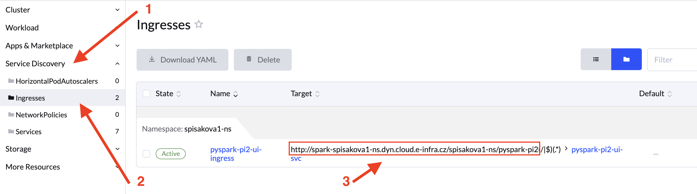

The [Spark Operator](https://github.com/GoogleCloudPlatform/spark-on-k8s-operator) aims to make specifying and running Spark applications as easy and idiomatic as running other workloads on Kubernetes. We have deployed cluster-wide Spark Operator that defines kinds `ScheduledSparkApplication` and `SparkApplication`, full documentation on kinds' structure is available [here](https://github.com/GoogleCloudPlatform/spark-on-k8s-operator/blob/master/docs/api-docs.md). The official and detailed user guide is available [here](https://github.com/GoogleCloudPlatform/spark-on-k8s-operator/blob/master/docs/user-guide.md).

## Important Configuration
You have to set `spec.driver.serviceAccount` to  `default`, otherwise your spark application will fail on permission issues. The Spark example feature `hostPath` as volume source but this won't work in the cluster since host mounts are forbidden. Please use `persistentVolumeClaim` instead ([examples](https://github.com/GoogleCloudPlatform/spark-on-k8s-operator/blob/master/docs/user-guide.md#mounting-volumes)) and don't forget to create [PVC](https://docs.cerit.io/docs/pvc.html#pvc).

## Other Configuration

### Spark UI

If you want to use Spark UI, you have to include following code snippet in spark application YAML. 

```
  sparkUIOptions:
    ingressAnnotations:
      cert-manager.io/cluster-issuer: letsencrypt-prod
      kubernetes.io/ingress.class: nginx
      kubernetes.io/tls-acme: 'true'
    ingressTLS: (optional section)
        secretName: [appname]-tls
```

The snippet ensures application will be reachable (while running) on `https://spark-<namespace-of-spark-application>-ns.dyn.cloud.e-infra.cz/<namespace-of-spark-application>/<spark-application-name>`. If you would like to expose the application on `https`, add section `ingressTLS` with `secretName` set to any string you want. However, we suggest setting it to `[metadata.name]-tls`. The final address can look like:
```
https://spark-spisakova1-ns.dyn.cloud.e-infra.cz/spisakova1-ns/pyspark-pi2
```
but is also visible in Rancher UI, follow the steps to see its final form. When you copy the address into the browser, omit the last character group `(/|$)(.*)` (a Rancher related issue). 

  

When you access the path, you should be presented with dashboard similar to

  


