# Praktické ukázky

## Jupyterhub

TBD

## Binderhub

TBD: ljocha

## Rancher

### Přihlášení

Přihlášení do webového rozhraní rancher je na adrese [https://rancher.cloud.e-infra.cz](https://rancher.cloud.e-infra.cz). Na úvodní obrazovce pokračujte kliknutím na `Log in with Shibboleth`.

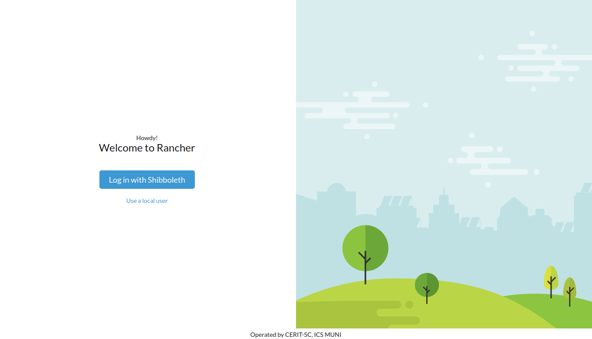

Následně zvolte `e-INFRA CZ AAI`

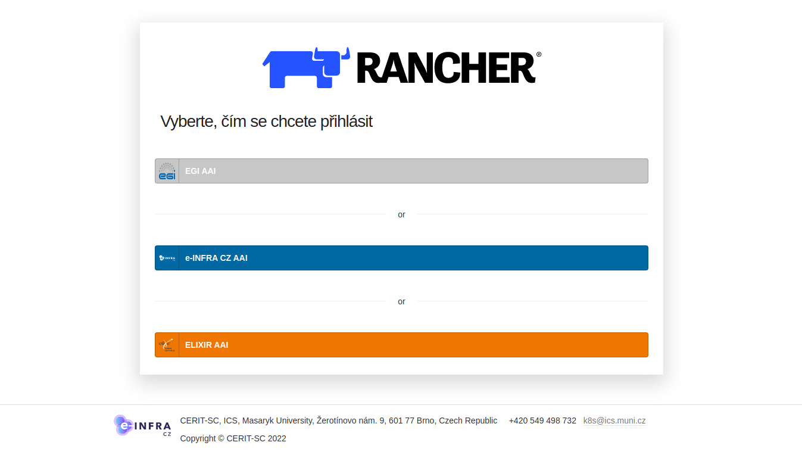

Dále pak `e-INFRA CZ password`. Abyste nemuseli v dlouhém seznamu hledat, doporučujeme do políčka `Log in with` napsat `infra`. A následně vybrat `e-INFRA CZ password`.

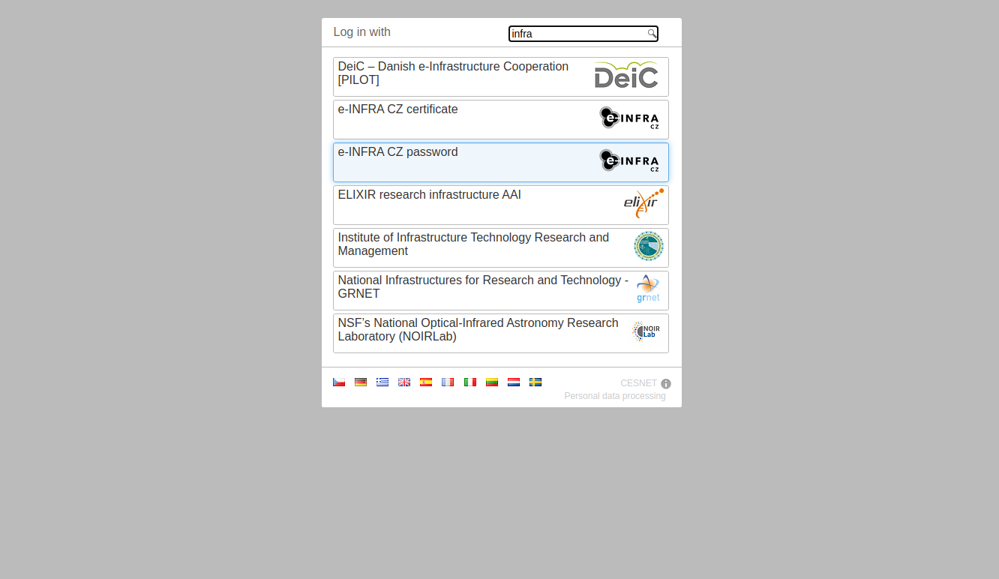

Zobrazí se výzva pro zadání jména a hesla do Metacentra. V případě, že nemáte účet v Metacentru, lze zvolit vaši domovskou instituci.

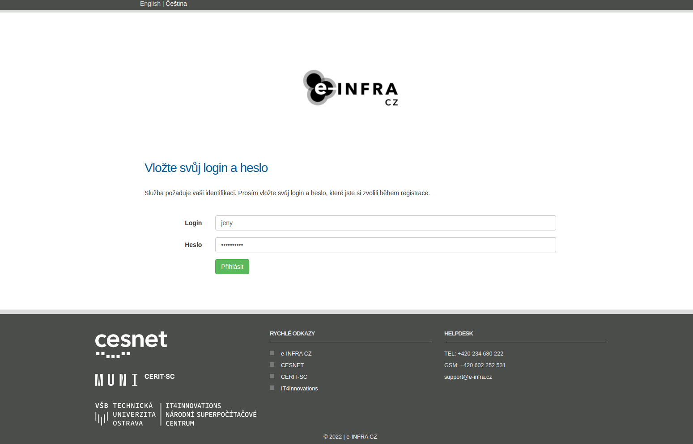

Pro pokračování je třeba odsouhlasit předání údajů jako je např. vaše e-mailová adresa.

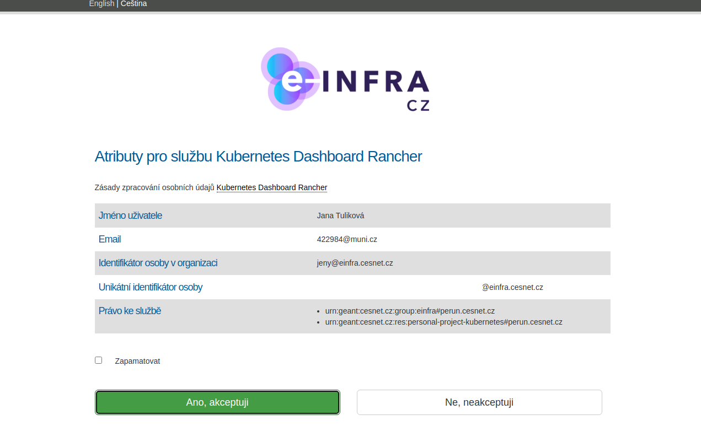


Může se stát, že se zobrazí tato chybová stránka, k tomu dojde v případě, že přihlašovací proces byl příliš pomalý (např. přepínání mezi návodem a přihlašováním). Pak stačí celý proces jen zopakovat a přihlášení se již povede.


### Dashboard

Po úspěšném přihlášení se zobrazí úvodní plocha. 

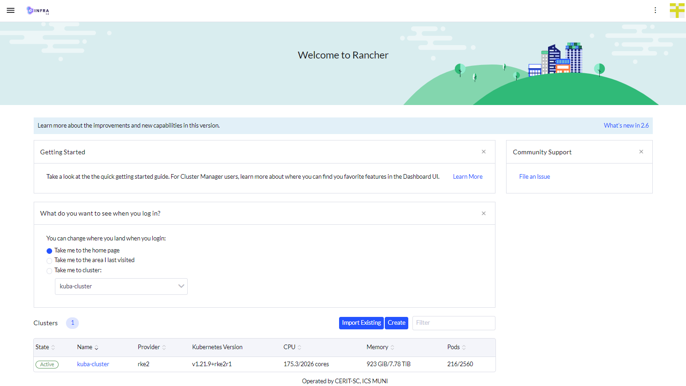

Může se stát, že po přihlášení není viditelný žádný cluster, zejména `kuba-cluster`. V tomto případě počkejte cca 1 minutu a dejte obnovit stránku prohlížeče (Reload). Přebytečná okna jako `Getting Started` nebo `What do you want to see when you log in?` křížkem zavřít. 

Dále je třeba pokračovat kliknutím na `kuba-cluster`.


Tím se dostáváte k ploše konkrétního clusteru, kde lze zobrazit přehledy, pouštět předpřipravené aplikace, atd.

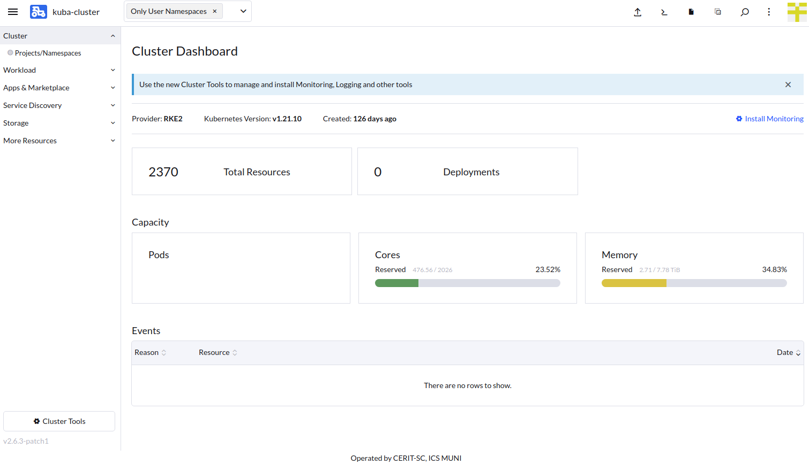

---

## Aplikace

Následují ukázky spuštění předpřipravených aplikací jako jsou RStudio server a Matlab. Pro Matlab je nutné mít fungujícího `vnc` klienta, na Linuxu např. `vncviewer`, na Mac OS stačí *Safari* prohlížeč.

Žádný kroků uvedených níže nelze vynechat, jde o nezbytné minimum.

Na úvod upozornění, pro aplikace se zadávají požadavky na zdroje. Jak bylo zmíněno v prezentaci, je limit 20 CPU a 40GB Memory, zadání vyšších požadavků způsobí nespuštění aplikace.

### Rstudio

V předchozí sekci bylo ukázáno jak se dostat na hlavní plochu `kuba-cluster`. Pro úspěšný začátek spuštění je nutné začít na táto ploše.


#### Výběr Aplikace

Prvně je třeba se ujistit, že není zvolený žádný *Namespace* (viz šipka číslo 1). Jde o dočasnou chybu Rancheru, kdy při zvoleném *Namespace* neukazuje některé položky v Menu vlevo. Následně se pokračuje v navigaci přes `Apps & Marketplace` (šipka 2) a pak `Charts` (šipka 3). Dle šipky 4 je třeba vybrat pouze `cerit-sc`, jinak se nepřehledně ukazují i ostatní nerelevantní aplikace. A nakonec se vybere samotná aplikace `rstudio-server` (viz šipka 5, skutečná poloha ikony aplikace se liší, jak aplikace přibývají). 


#### Instalace Aplikace

Pod `Chart Versions` lze vybrat verzi instalační šablony. Vybereme verzi 1.3. Tato verze nijak nesouvisí s verzí RStudio serveru. Následně pokračujeme `Install`.


Nyní začínáme parametrizovat instalaci a spuštění aplikace. Ve většině případů necháme vybraný *Namespace* ve tvaru `příjmení-ns` (šipka 1). Rovněž jméno aplikace lze nechat výchozí (šipka 2). Pokračujeme Next (šipka 3).


Nyní se dostáváme k samotné parametrizaci aplikace. V první odrážce vybereme verzi R, pro vyzkoušení vybereme `R 4.0.5/Ubuntu 20.04` bez `Full` přípony. 


V další záložce s názvem `Security` vyplníme heslo. Je vhodné se vyvarovat jednoduchých hesel a zároveň z technických důvodů je nutné nepoužívat znaky `{` a `}`. Zároveň je doporučeno zvolit heslo, které není běžně použité jinde. `Network policy` zůstane nezatrhnutá.


V třetí záložce necháme pouze zatrženou volbu `Enable persistent home`. 

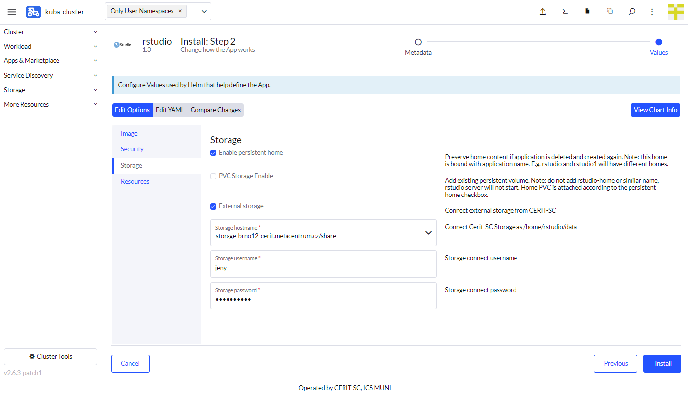

Poslední záložku se zdroji necháme pro demo s předvyplněnými hodnotami. A pokračujeme volbou Install. 


Zobrazí se následující překryv, kde je nutné počkat na oznámení `SUCCESS` (šipka 1). Tímto se aplikace nainstalovala a je připravena k použití. Předchozí výpis s instalací zavřeme křížkem (šipka 2).


#### Přihlášení do běžící instance

Projdeme přes menu vlevo `Service Discovery` (šipka 1) do `Ingresses` (šipka 2). Pokud uvidíme řádek s názvem `cm-acme-http-solver...` (šipka 3), je třeba chvíli vyčkat dokud nezmizí (v tomto momentě se získává SSL certifikát). Následně se pokračuje kliknutím na odkaz u šipky 4. Každý uživatel má vlastní podobu odkazu. Obsahuje zvolené jméno (typicky `rstudio`) a zvolený *Namespace*. 


Pokud vše šlo dobře, po kliknutí na zmíněný odkaz se zobrazí přihlašovací obrazovka. Zde se vyplní jméno **`rstudio`** (to je fixně přednastavené) a heslo, které bylo zadáno do formuláře při parametrizaci (to, co nemělo obsahovat znaky `{` a `}`).


#### Použití aplikace

Po spuštění lze aplikaci začít používat např. jednoduchým `print` příkazem nebo `barplot` příkazem (červené upozornění nemá na demo vliv, při použití `Full` verze R by se nemělo zobrazit). 


#### Smazání aplikace

Pokud aplikace již není potřeba, je vhodné ji smazat. Ze základní plochy Rancheru se pokračuje do `App & Marketplace` (šipka 1) přes `Installed Apps` (šipka 2), vybereme aplikaci (šipka 3) a následně přes `Delete` (šipka 4) smažeme. 


---

### Matlab

Další ukázkovou aplikací je Matlab. Pro vyzkoušení této aplikace je nutný *VNC* prohlížeč na počítači, ze kterého pracujete, bez něj nelze aplikaci zobrazit. Doporučujeme před zkoušením Matlabu smazat předchozí aplikaci - RStudio dle posledního bodu postupu. Stejně jako u RStudia začneme na úvodní ploše. Návrat na ni lze provést Kliknutím vlevo nahoře na symbol menu `≡` a následně na `kuba-cluster`.


#### Výběr Aplikace

Následně vybereme aplikaci stejným postupem. Prvně je třeba se ujistit, že není zvolený žádný *Namespace* (viz šipka číslo 1). Jde o dočasnou chybu Rancheru, kdy při zvoleném *Namespace* neukazuje některé položky v Menu vlevo. Následně se pokračuje v navigaci přes `Apps & Marketplace` (šipka 2) a pak `Charts` (šipka 3). Dle šipky 4 je třeba vybrat pouze `cerit-sc`, jinak se nepřehledně ukazují i ostatní nerelevantní aplikace. A nakonec se vybere samotná aplikace `Matlab` (viz šipka 5, skutečná poloha ikony aplikace se liší, jak aplikace přibývají).

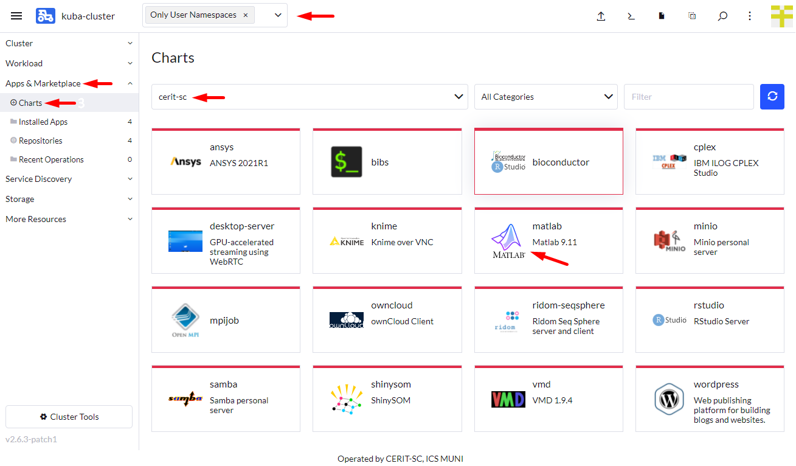

#### Instalace Aplikace

Pod `Chart Versions` lze vybrat verzi instalační šablony. Vybereme verzi 9.11. V tomto případě verze šablony přesně odpovídá i verzi aplikace. Následně pokračujeme `Install`.


Nyní začínáme parametrizovat instalaci a spuštění aplikace. Ve většině případů necháme vybraný *Namespace* ve tvaru `příjmení-ns` (šipka 1). Rovněž jméno aplikace lze nechat výchozí (šipka 2). Dále zatrhneme `Customize Helm options before install` (šipka 3). Pokračujeme Next (šipka 4).

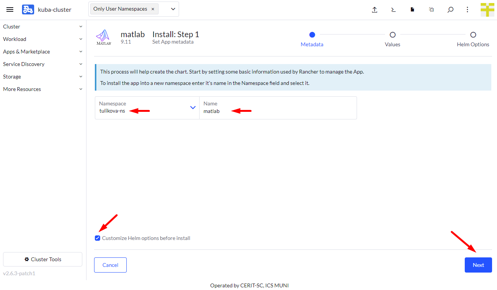

Nyní se dostáváme k samotné parametrizaci aplikace. V první odrážce necháme vybranou VNC verzi. 


V další záložce s názvem `Password Settings` vyplníme heslo. Je vhodné se vyvarovat jednoduchých hesel a zároveň z technických důvodů je nutné nepoužívat znaky `{` a `}`. Zároveň je doporučeno zvolit heslo, které není běžně použité jinde.


V třetí záložce necháme pouze zatrženou volbu `Enable persistent home`. Tj. nebude zatrženo a vybráno PVC ani External storage.


Poslední záložku se zdroji necháme pro demo s předvyplněnými hodnotami. A pokračujeme volbou `Next`. 


Objeví se poslední část formuláře, kam je potřeba vyplnit `Timeout` na hodnotu 1200 (Matlab je velký kontejner a může trvat, než se stáhne). A následně již dáme `Install`.

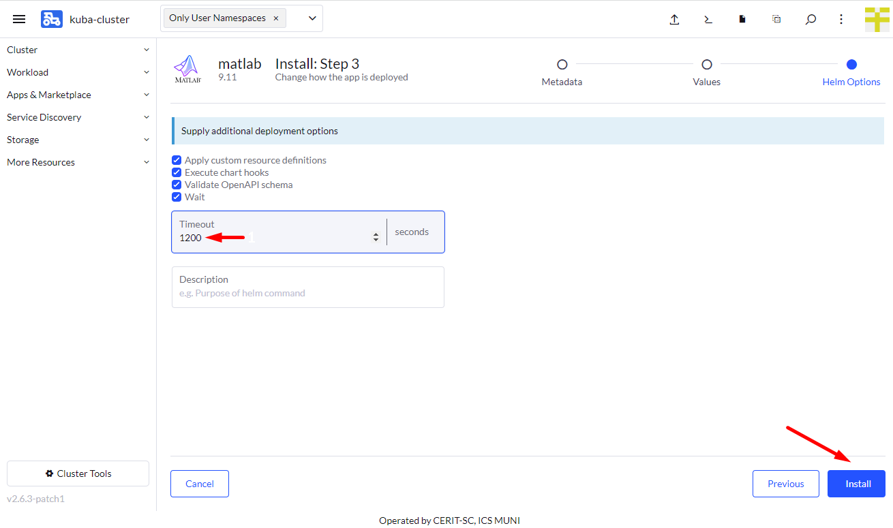

Zobrazí se následující překryv, kde je nutné počkat na oznámení `SUCCESS` (šipka 1). Tímto se aplikace nainstalovala, ale na rozdíl od RStudia ještě není připravena k použití. Zavřeme překryv křížkem (šipka 2). 


V levém menu přejdeme přes `Workload` (šipka 1) do `Pods` (šipka 2) a je třeba vyčkat, než uvidíme označení `Running` (šipka 3), až v této chvíli aplikace běží.


Nyní se lze do aplikace přihlásit. K tomu je zapotřebí získat IP adresu, na kterou se má připojit VNC klient. Tu získáme navigací na `Service Discovery` v levém menu (šipka 1), následně `Services` (šipka 2) a konečně najetí myší nad `5900/TCP` (šipka 3) by mělo ukázat v dolním rohu prohlížeče cílovou IP adresu (šipka 4). Variantně, pokud to prohlížeč dovolí, lze kliknout pravým tlačítkem myši nad `5900/TCP` a dát kopírovat odkaz. Adresa bude vždy začínat `147.251.253.` a je nutné tedy zjistit jen poslední 3 číslice.


Tuto IP adresu použijeme ve VNC klientu např. takto. Do přihlašovacího okna je nutné vyplnit heslo z formuláře výše (to, co nemělo obsahovat znaky `{` a `}`. V případě Safari prohlížeče stačí napsat do URL `vnc://147.251.253.x` kde `x` je konkrétní adresa z předchozího bodu.


Pokud je vše správně připojí se vzdálená plocha.


Zde je potřeba vybrat požadovanou licenci a pokračovat kliknutím na `Perform licence check and run`. 


Pak se již spustí samotný Matlab.


Ukázka práce v Matlabu je již nad rámec tohoto webináře. Zbytek desktopu je však funkční také.

#### Smazání aplikace

Pokud aplikace již není potřeba, je vhodné ji smazat. Ze základní plochy Rancheru se pokračuje do `App & Marketplace` (šipka 1) přes `Installed Apps` (šipka 2), vybereme aplikaci (šipka 3) a následně přes `Delete` (šipka 4) smažeme. Je vhodné před smazáním ukončit VNC klienta.


---

## Vlastní aplikace

V této části si ukážeme, jak pustit vlastní aplikaci v Kubernetes z příkazové řádky. Pro tento krok je potřeba mít nainstalovaný nástroj `kubectl`. Pro hlavní platformy je k dispozici ke stažení:

 * [Linux](https://dl.k8s.io/release/v1.22.0/bin/linux/amd64/kubectl)
 * [MacOS](https://dl.k8s.io/release/v1.22.0/bin/darwin/arm64/kubectl)
 * [Windows](https://dl.k8s.io/release/v1.23.0/bin/windows/amd64/kubectl.exe)

Variantně se lze přihlásit na uzel `zuphux.cerit-sc.cz` pomocí metacentrového účtu a využít nainstalovaného `kubectl` nástroje.

Poznámka: Je nutné použít verzi `kubectl` nejvýše **1.22.0** a alespoň **1.20.0**. Výše uvedené odkazy a instalace na `zuphux.cerit-sc.cz` tuto podmínku splňují.

Dále je nutné stáhnout konfiguraci. Tato se nachází na základní ploše rancheru.


Na této ploše je k dispozici konfigurace (viz šipka). Tu je potřeba uložit. Na Linuxu a MacOS lze uložit do home do `~/.kube/config`. Na Windows se nachází v `%USERPROFILE%\.kube\config`. Variantně lze pri každém použití příkazu `kubectl` specifikovat místo uložení `config` pomocí parametru `--kubeconfig='/cesta/config'`. Ve většině případů bude potřeba složku `~/.kube` předem vytvořit.


Zároveň je nutné zjistit *Namespace*, který budete používat, kliknutím na `Only User Namespaces` (šipka 1) a následně je vidět jméno *Namespace* (šipka 2). Obecně je název odvozován od příjmení uživatele. 


### Manifest

Začneme vytvořením několika manifestů. Začneme definicí kontejneru, lze stáhnout [zde](deployments/hello-deployment.yaml). Zarovnání jednotlivých částí je důležité a musí zůstat, jak je.

```yaml
apiVersion: apps/v1
kind: Deployment
metadata:
  name: hello-kubernetes
spec:
  replicas: 1
  selector:
    matchLabels:
      app: hello-kubernetes
  template:
    metadata:
      labels:
        app: hello-kubernetes
    spec:
      securityContext:
        runAsUser: 1000
      containers:
      - name: hello-kubernetes
        image: paulbouwer/hello-kubernetes:1.9
        ports:
        - containerPort: 8080
```

Pokud si tento deployment uložíme pod názvem `hello-deployment.yaml`, tak jej aplikujeme pomocí příkazu: `kubectl create -f hello-deployment.yaml -n namespace`, kde místo namespace uvedeme vlastní *Namespace*. Příkaz předpokládá, že aktuální adresář je ten, ve kterém je soubor `hello-deployment.yaml` uložen.

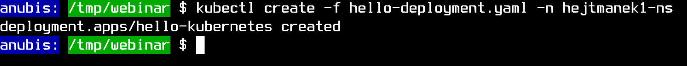

Tímto krokem se spustil kontejner z *docker hubu* s názvem a tagem `paulbouwer/hello-kubernetes:1.9`. V rancheru jej lze zobrazit přes `Workload` (šipka 1) a `Pods` (šipka 2).

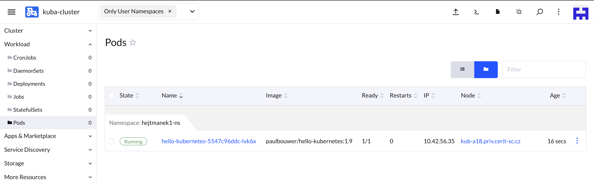

### Vystavení do Internetu

K vystavení do Internetu je nutné vytvořit objekt `Service`. Opět ke stažení [zde](deployments/hello-service.yaml).

```yaml
apiVersion: v1
kind: Service
metadata:
  name: hello-kubernetes-svc
spec:
  type: ClusterIP
  ports:
  - name: hello-kubernetes-port
    port: 80
    targetPort: 8080
  selector:
    app: hello-kubernetes
```

Pokud si tento manifest uložíme pod názvem `hello-service.yaml`, tak jej aplikujeme pomocí příkazu: `kubectl create -f hello-service.yaml -n namespace`, kde místo namespace uvedeme vlastní *Namespace*. Příkaz předpokládá, že aktuální adresář je ten, ve kterém je soubor `hello-service.yaml` uložen.

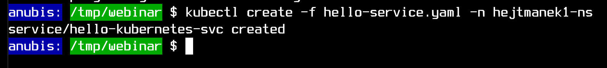

Druhým krokem k vystavení do Internetu je vytvoření objektu `Ingress`. Opět ke stažení [zde](deployments/hello-ingress.yaml).
```yaml
apiVersion: networking.k8s.io/v1
kind: Ingress
metadata:
  name: hello-kubernetes-ingress
  annotations:
    kubernetes.io/ingress.class: "nginx"
    kubernetes.io/tls-acme: "true"
    cert-manager.io/cluster-issuer: "letsencrypt-prod"
spec:
  tls:
    - hosts:
        - "test-hello-$namespace.dyn.cloud.e-infra.cz"
      secretName: test-hello-dyn-clout-e-infra-cz-tls
  rules:
  - host: "test-hello-$namespace.dyn.cloud.e-infra.cz"
    http:
      paths:
      - backend:
          service:
            name: hello-kubernetes-svc
            port:
              number: 80
        pathType: ImplementationSpecific
```

V tomto případě je nutné soubor drobně upravit. Na místo `$namespace` je nutné napsat skutečný název používaného *Namespace*. Pokud tento krok přeskočíme vznikne aplikací chyba. 

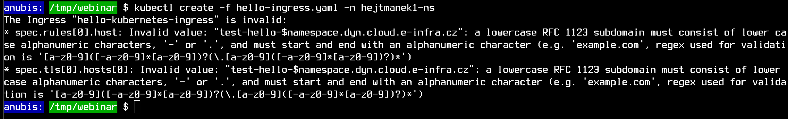

Soubor opět uložíme např. do `hello-ingress.yaml` a aplikujeme po úpravě podobně jako ostatní: `kubectl create -f hello-ingress.yaml -n namespace`, kde místo namespace uvedeme vlastní *Namespace*. Příkaz předpokládá, že aktuální adresář je ten, ve kterém je soubor `hello-ingress.yaml` uložen.

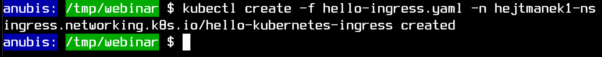

Pokud se vše povedlo, vrátíme se k rancheru a jeho ploše, kde přes `Service Discovery` (šipka 1) a `Ingresses` (šipka 2) uvidíme klikací URL na běžící aplikaci.

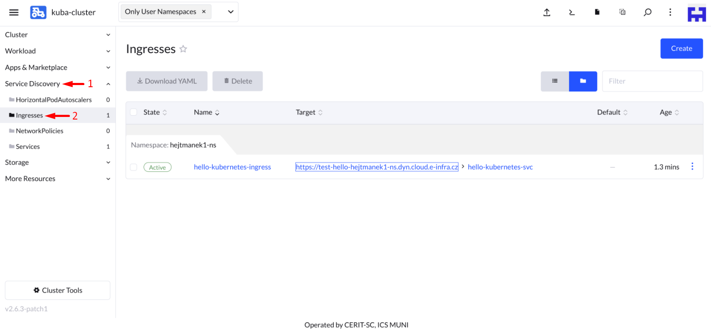

A po kliknutí na *Target* se zobrazí samotná aplikace.

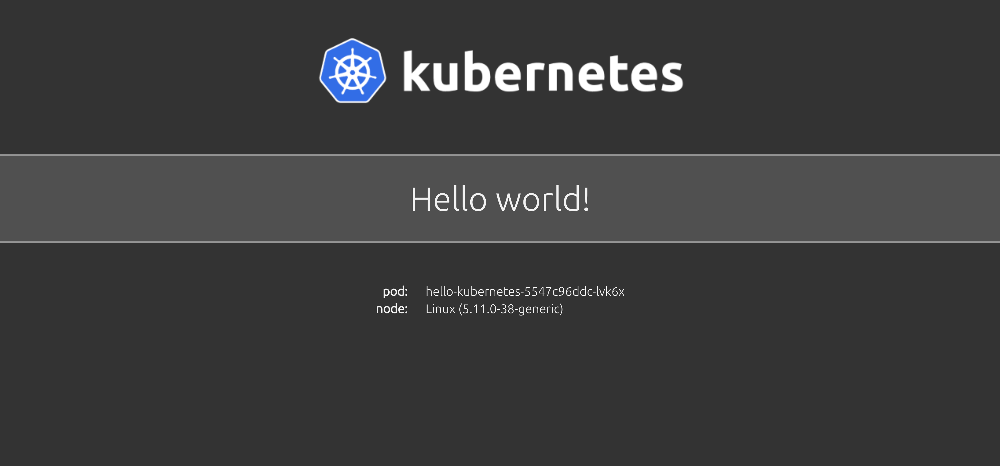


### Smazání aplikace

Po skončení ukázky je vhodné aplikaci smazat. To se provede pomocí následujících tří příkazů, kde za `-n` se dosadí vlastní *Namespace*.
```
kubectl delete -f -f hello-ingress.yaml -n hejtmanek1-ns
kubectl delete -f -f hello-service.yaml -n hejtmanek1-ns
kubectl delete -f -f hello-deployment.yaml -n hejtmanek1-ns
```
